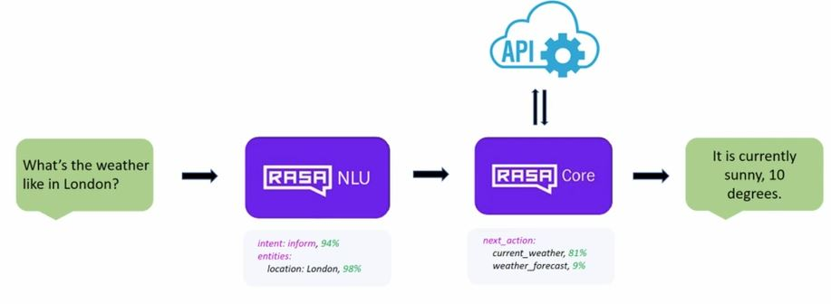

# Chatbot
## Rasa Stack
The Rasa Stack is a set of open source machine learning tools for developers to create contextual text- and voice-based chatbots and assistants. Supported by thousands of community members. [Official site](https://rasa.com/).

## Overview


[Image Source](https://vimeo.com/254777331)
- ```pip install -r requirements.txt```
- [Weatherbot](https://github.com/JustinaPetr/Weatherbot_Tutorial) by [JustinaPetr](https://github.com/JustinaPetr) is a great resource to start.
- **Spacy language model** is used for parsing and extracting necessary information from the incoming text. ``python -m spacy download en``
- [``rasa-nlu-trainer``](https://github.com/RasaHQ/rasa-nlu-trainer) is a tool to edit your training examples for rasa NLU.
- **Rasa NLU** is meant for generating models which do intent classification and entity extraction from the text. As this is based on ML/AI, model training requires the training data.  Installation ```npm i -g rasa-nlu-trainer``` Running ```rasa-nlu-trainer```
- [Rasa UI](https://github.com/paschmann/rasa-ui) is a web application for the Rasa NLU backend.